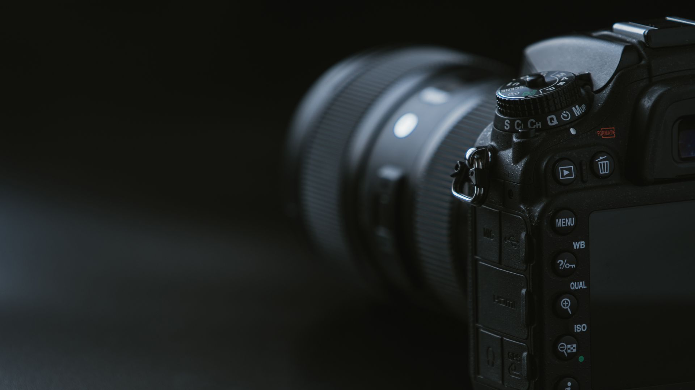

# 📸 Photography Sidebar Menu

A simple and modern **Photography Sidebar Menu** built using **HTML and CSS**.

This project features a sliding sidebar navigation menu with Font Awesome icons, social media links, hover effects, and a full-screen photography background.

## 🌐 Live Preview

The project contains a full-screen camera background with a left-side navigation menu.

### 📸 Preview



## ✨ Features

- 🍔 Hamburger menu button
- 📂 Sliding sidebar navigation
- ❌ Close button
- 🖼️ Photography-themed background
- 🎨 Modern dark UI
- ✨ Smooth CSS transitions
- 🖱️ Hover effects
- 🔗 Navigation menu items
- 📱 Social media icons
- 📐 Full-screen responsive layout

## 📋 Menu Items

The sidebar contains the following navigation options:

- 🖼️ Gallery
- 🔗 Shortcuts
- 🎞️ Exhibits
- 📅 Events
- 🛍️ Store
- 📞 Contact
- 💬 Feedback

## 🌐 Social Media

The sidebar also includes icons for:

- Facebook
- Twitter / X
- Instagram
- YouTube

## 🛠️ Technologies Used

- HTML5
- CSS3
- Font Awesome
- Google Fonts – Poppins

## 📂 Project Structure

```text
CSS-Minor-Project/
│
├── index.html
├── style.css
├── photo.jpg
└── README.md